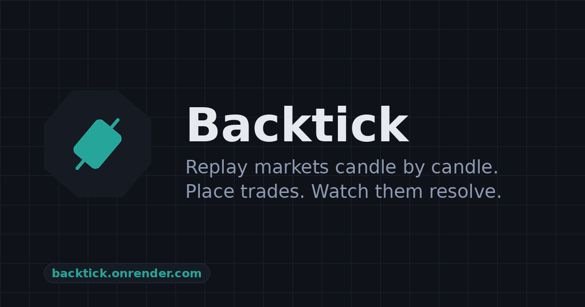

# Backtick

**Replay the market tick by tick.** Backtick is a local-first, open-source web app
for replaying Binance history candle-by-candle *and* trade-by-trade — with a real
bid/ask tape, footprint, and hypothetical trades — built for discretionary
backtesting.

🌐 **Live:** [backtick.to](https://backtick.to) · 📖 [Docs](https://backtick.to/docs) · ℹ️ [About](https://backtick.to/about)



## Why it's different

Most replay tools just move a candle forward. Backtick surfaces the order flow
*inside* the bar — the reads other platforms gate behind a premium tier:

- **True time & sales** — every print tagged buy/sell from Binance aggTrades' real
  `is_buyer_maker` flag (green = aggressive buy at the ask, orange = sell at the
  bid), with a large-prints percentile highlighter.
- **Tick-by-tick replay + synced tape** — step or auto-play individual aggTrades as
  the forming candle rebuilds, with the tape in lockstep; 1×–200×.
- **Footprint** — per-candle buy/sell volume by price level, so absorption and
  imbalance are visible inside the bar.
- **Open source & local-first** — runs on your machine, reads straight from Binance,
  and your hypothetical trades stay in your own session.

Plus the usual sandbox: candle replay, market/limit trades with SL/TP, indicators
(EMA / RSI / CVD / Volume / Volume Profile / Liquidations), drawing tools, a
watchlist, live + replay modes, and an installable PWA.

## Quickstart

Uses a virtualenv (never install into system Python):

```bash
python3 -m venv /tmp/backtick_venv
/tmp/backtick_venv/bin/pip install -r requirements.txt -r requirements-dev.txt
/tmp/backtick_venv/bin/uvicorn backend.main:app --reload --port 8765
```

Open <http://localhost:8765> — the marketing landing is at `/`, the chart app at
`/app`. It opens on SOLUSDT 4h, roughly two months back, so there's something to
step through immediately.

## Tests

```bash
/tmp/backtick_venv/bin/pytest -q     # backend unit tests (no network)
npx playwright test                  # frontend E2E smoke (needs server on :8765)
```

Unit tests cover the riskiest logic — gap-fill (`_missing_ranges`) and trade
SL/TP/limit fills + snapshot round-trip. The Playwright smoke test hits live
Binance, so treat a network failure as flaky, not a regression.

## Layout

```
backend/
  main.py          FastAPI app + chart/replay routes, page routes, /healthz
  binance.py       historical klines via Binance REST + parquet cache w/ gap-fill
  replay.py        Session / Trade / SessionStore; SL/TP + limit-fill logic
  aggtrades.py     aggTrades fetch for tick replay / CVD
  auth.py, routes_auth.py, db.py, models.py, snapshots.py, exchange_info.py
frontend/
  landing.html, docs.html, about.html, contact.html   marketing site (no-JS)
  site.css                                             marketing styles
  index.html, app.js, style.css                        the chart app
  avatars.js, symbol-picker.js, pwa.js, auth-modal.js
  sw.js            service worker (CACHE_VERSION bumped per deploy)
  manifest.webmanifest, icons/
scripts/
  bump_sw_version.py   content-hashes the shell into sw.js CACHE_VERSION
```

## Deploy

Deploys to [Render](https://render.com) from `render.yaml` (auto-deploy on push to
`main`). The build runs `scripts/bump_sw_version.py` so clients pick up new frontend
assets via the service-worker cache. Secrets — `SESSION_SECRET`, Google OAuth
(`GOOGLE_CLIENT_ID` / `GOOGLE_CLIENT_SECRET`) — live in environment variables, never
in the repo.

## Disclaimer

Backtick is a backtesting and education tool, not financial advice. Markets are
risky; nothing here is a recommendation to trade.

## License

[MIT](LICENSE) © 2026 Danial Zakaria
